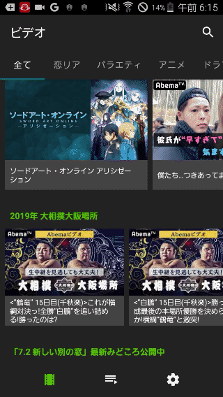

Amberは[AbemaTV](https://abema.tv/) をダウンロード・再生できるAndroidアプリです。

## 多くのバグが残存しています

本アプリには多くのバグが残存しています。今後アップデートを行いながら修正したいと思いますので、ご容赦ください。

## Amberでできること

- AbemaTVのダウンロード・再生（有料番組を含む
- 番組検索

## Amberでできないこと

- 放送中の番組の再生
- 番組表の表示
- AbemaTVがダウンロードを許可していない番組のダウンロード
- 放送されたがビデオにアーカイブされていない番組の再生・ダウンロード
- 予約ダウンロード

## 広告・課金等について

- 今のところ広告表示や課金が必要な機能はありません。

## 本アプリについて

- 本アプリを使う前に、Androidの設定で「提供元不明のアプリ」を有効にしてください。
- [こちらのサイト](https://www.virustotal.com/) などで、本アプリの安全性を確かめることができます。
- *Android5.0*以上が必要です。

## アプリをダウンロード

[v0.1.1(2019/03/27リリース)](https://github.com/AmberAmeba/Android/releases/download/0.1.1/app-release.apk)
前バージョンとの変更点

- 軽微な不具合の修正

[アプリへの意見・要望を送る](https://forms.gle/TZiDwkkFCDYEzGyS9)
